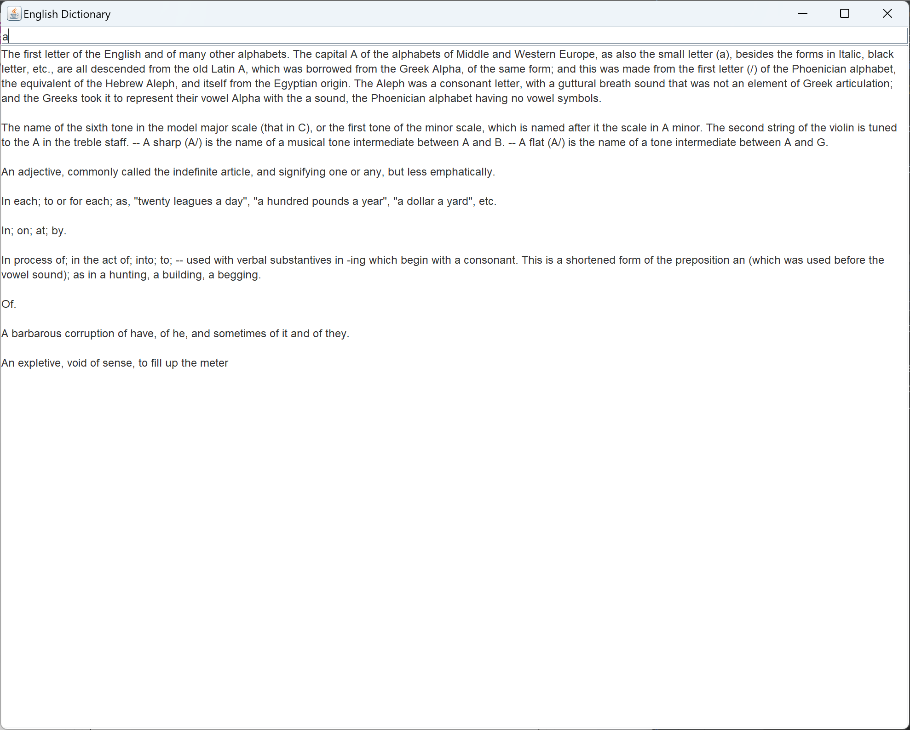

# English Dictionary

A dictionary is a listing of lexemes from the lexicon of one or more specific languages, often arranged alphabetically (or by consonantal root for Semitic languages or radical and stroke for logographic languages), which may include information on definitions, usage, etymologies, pronunciations, translation, etc. It is a lexicographical reference that shows inter-relationships among the data.
[wiki](https://en.wikipedia.org/wiki/Dictionary)

